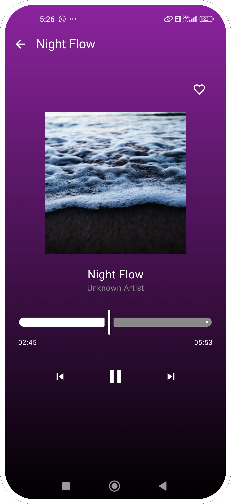

# 🎧 KBeat - Jetpack Compose Music Player App

KBeat is a modern offline music player built using **Jetpack Compose**, **ExoPlayer**, **Hilt**, and **Room**.  
It supports category-wise filtering, favorites, shuffle, and local song playback from the `assets` folder.

> ⚙️ Development: MVP completed  
> 🎵 Add your `.mp3` files manually to: `app/src/main/assets/`

---

## ✅ Features Completed

### 🖼️ SplashScreen
- App logo with animation

### 🏠 HomeScreen
- Shows music categories in a 2x2 grid
- Top bar includes a Favorites icon → opens FavoritesScreen

### 🎶 SongListScreen
- Lists songs from selected category
- 🔀 Shuffle or ▶️ Play All
- Click any song to play instantly

### 🎵 PlayerScreen
- Plays songs using **ExoPlayer**
- Seekbar, Play/Pause, Next/Previous
- ❤️ Add or Remove from favorites using Room DB

### ❤️ FavoritesScreen
- Displays saved songs only
- Tapping plays song using PlayerScreen

---

## 🛠 Built With

- 🧩 Jetpack Compose — UI toolkit
- 💉 Hilt — Dependency Injection
- 🎵 ExoPlayer — Media3 audio playback
- 🧠 ViewModel — MVVM Architecture
- 📦 Room — For storing favorite songs
- 🔁 Navigation Compose — Screen transitions

---

## 📌 Planned Features

- 🔊 Background audio playback
- 🔐 DRM (protected file) support
- 🔍 Song search via top bar
- 🕓 Last Played / Recently Opened
- 🎛️ Playlist support (saved user lists)
- ☁️ Download or Export from assets
- 🏠 Quick Links (Favorites/Playlists on home)

---

## 🐞 Known Bugs

- In **FavoritesScreen**, if a song is removed and user clicks "Next/Previous" quickly, it may still play unless user waits or reopens the screen.


---

## 📸 Screenshots

<table>
  <tr>
    <td></td>
    <td></td>
    <td></td>
    <td></td>
  </tr>
  <tr>
    <td align="center"><strong>Splash</strong></td>
    <td align="center"><strong>HomeScreen</strong></td>
    <td align="center"><strong>SongListScreen</strong></td>
    <td align="center"><strong>PlayerScreen</strong></td>
  </tr>
</table>

---

## 📦 How to Run

1. Clone the repository:
   ```bash
   git clone https://github.com/MeteorBlitz/kbeat.git
