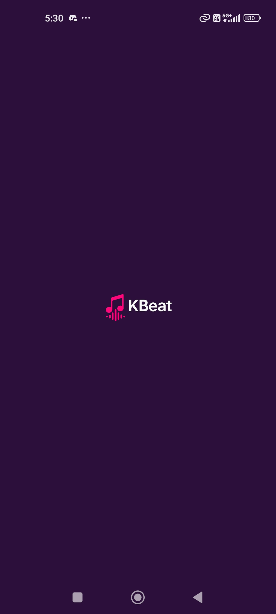
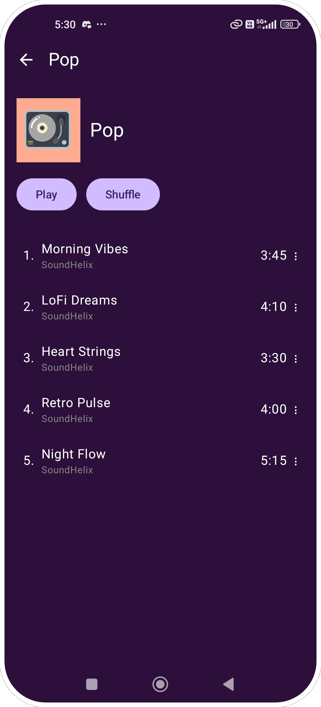

# 🎧 KBeat - Jetpack Compose Music Player App

KBeat is a simple offline music player app built using **Jetpack Compose**. It shows music by category and plays songs from the local `assets` folder. It is still under development and will use **MVVM**, **Navigation**, and **ExoPlayer**.

---
🎵 Note: MP3 files are not included in this repo.
Please add 3–5 MP3 songs to `app/src/main/assets/` manually before running the app.

---

## ✨ Features Completed

- ✅ **SplashScreen** with logo and animation
- ✅ **HomeScreen** with colorful category cards
- ✅ **SongListScreen** with:
  - Category image and title
  - Play and Shuffle buttons
  - Dummy song list (title, artist, duration, more options)
- ✅ **Song model** with 5 local songs in assets
- ✅ **Navigation setup** with category passing
- ✅ **TopBar UI** reused in all screens

---

## 🛠️ Built With

- 🧩 **Jetpack Compose** – UI toolkit
- 🎵 **Media3 ExoPlayer** – Music playback (upcoming)
- 🔁 **Navigation-Compose** – Move between screens
- 🧠 **ViewModel + Lifecycle** – MVVM (to be added)
- 💉 **Hilt** – Dependency injection setup
- 📦 Static songs from `assets` folder (no backend)

---

## 📸 Screenshots

| Splash | HomeScreen | SongListScreen |
|--------|------------|----------------|
|  |  |  |

---

## 📌 Upcoming Features

| Feature                  | Description                                    |
|-------------------------|------------------------------------------------|
| 🎵 Music Playback       | Play songs using `ExoPlayer` on tap            |
| 🧠 MVVM Structure        | Move logic to ViewModel                        |
| ❤️ Favorites / Playlist | Allow users to save favorites or playlists     |
| 🔍 SearchBar            | Add search to top bar                          |
| 🕓 Recent / Last Played  | Track last played song using SharedPreferences |
| 💾 Room DB              | Optional offline storage for songs             |
| 🎨 UI Polish            | Add animations like click scale or shimmer     |

---

## 🧑‍💻 Author

**Deepak Ondimuthu**  
[GitHub](https://github.com/MeteorBlitz) • [LinkedIn](https://www.linkedin.com/in/deepak-ondimuthu-752856a8/)

---

## 📜 License

This project is for learning and educational use.  
Not for commercial use unless permission is given.

---

> 🔔 *KBeat is in progress. Feel free to give suggestions or ideas!*
